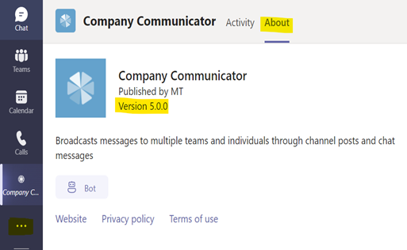

## Known Limitations
### 1. Author/publishing experience is not supported on Mobile

The tab where authors/creators of messages create a message is not supported on mobile. The recommended approach is to create the messages on the desktop only.

## FAQs

### 1. Are messages sent to guest users?
As of version 4.1.1, guest users are excluded from receiving messages. Note that they will still be able to view messages posted to a channel.

> **IMPORTANT:** If you are using a version of Company Communicator **v4.1.1**, please update to the latest version, and see the guidance in [Excluding guest users from messages](https://github.com/OfficeDev/microsoft-teams-apps-company-communicator/wiki/Excluding-guest-users-from-messages).

### 2. Does Company Communicator respond with a message to users who ask a question or reply to a message?
No, by default the bot only sends messages and does not respond with a message. The bot can be customized to reply with a custom message or connected to a knowledge base to respond with answers from the knowledge base.

### 3. Is it mandatory to choose multi-tenant account types while app registration?
Yes. Bot Channels Registration only supports multi-tenant account types. Please choose multi-tenant type options only even if the app users belong to single-tenant only. Please refer [here](https://docs.microsoft.com/en-us/azure/bot-service/bot-service-quickstart-registration?view=azure-bot-service-4.0#manual-app-registration) for more information

| Type | Description |
|--|--|
| Accounts in any organizational directory (Any Azure AD - Multitenant) | This option provides less exposure by restricting access and in case OAuth is not supported. |
| Accounts in any organizational directory (Any Azure AD - Multitenant) and personal Microsoft accounts (for example, Xbox, Outlook.com) | This option is well-suited to support OAuth and bot authentication. |

### 4. How to clone the GitHub repository?
Please follow this [link](https://docs.github.com/en/github/creating-cloning-and-archiving-repositories/cloning-a-repository) for detailed instructions on cloning GitHub repository to create a local copy on your computer and sync between the two locations.

### 5. I'm using v4.1 Company Communicator. When I resync the Company Communicator, can I set up the v4.1 branch instead of main or v4.1.x?
If you're planning to deploy version ~4, you can select the branch as v4.x but it will not point to the specific 4.1 version. Instead, it will have the highest 4.x version i.e., v4.1.5. 

### 6. Can I change the app service plan without any issues? 
Yes, the app service plan can be changed to S1 without going for re-deployment. The recommended instance is S2 for better performance, however the app will work for S1 as well, provided the messages sent to limited users. 

### 7. When I export the results of a sent message the author bot on the desktop client shows "Go back to the main window to see this content". 
 
 
 The issue seems specific to your Teams setup and not related to the Company Communicator app. 

### 8. I'm sending messages every week to more than 100k users, does CC supports this volume? Which strategy is suggested in this case? 
Yes, refer below on the versions and the volumes that CC supports sending,

- 5.x supports 2 million messages (approximately). 
- 4.1.5 supports 100k messages (approximately). 

### 9. Is it possible to use Linux over Windows in App service plan? 
The default app service plan for CC deployment is Windows, if you want to use Linux, then you need to customize the ARM template to deploy it using Linux and go for fresh installation with the customized version. 

### 10. How do I know the version of the app? 

### 11.Can I update the list of Authors after deploying the Company Communicator App?
Yes, you can update the list of Authors even after deploying the Company Communicator App by 
going to the deployed Azure App Service.
1. Go to deployed Azure Resource Group -> Azure App Service.(images/11.1.PNG)
2. Select the configuration blade from the Azure App service and updated the 
AuthorizedCreatorsUpns app setting value.(images/11.2.PNG)
3. Save and then restart the App.(images/11.3.PNG)

### 12.How can I add the CC app to large number of Teams in bulk? Say with the deployment of CC, we need to make sure 2000 Teams have CC User App Installed so that CC Authors can view the channels and send out the messages to the selected Teams?

 There are 2 ways through which CC User App can be installed directly to Teams:
• Graph API 
o You can create a script to take the Team IDs in bulk as input either from a CSV or 
excel file and invoke the Graph API to add CC User App to the Teams.(images/12.1.PNG)
o You can get the App id from Teams Admin Centre – Teams App Store.(images/12.2.PNG) 
 
• Teams PowerShell Command 
o You can create a script to take the Team IDs in bulk as input either from a CSV or 
excel file and invoke the Teams PowerShell command to add CC User App to the 
Teams.
o You can get the App id from Teams Admin Centre – Teams App Store as shown above.(images/12.3.PNG)

### 13.How to install Company Communicator in an external tenant? 

1. Grab the Azure AD tenant ID to the external tenant (this info is available in Azure AD, under 
Manage > Properties)
2. Grab the Application ID of the "Company Communicator Author App" - This is the ID created 
during the app registration in the home tenant.
3. Ask an Azure AD admin (for the external tenant) to grant admin consent to this app for the 
organization. Use this URL pattern with an AAD admin account and grant consent: 
https://login.microsoftonline.com/%EXTERMAL_TENANT_ID%/adminconsent?client_id=%CC_AUTHOR_APPID%
4. Go to the Azure Web App where Company Communicator is deployed and go to the App 
Configuration Settings - Change the value of the property named "AllowedTenants" and add 
the list of external tenant ID (with semicolon separation) - e.g. e517378c-47aa-4aa1-b4c4-
9a947b95392c;006ce5cb-7ecf-4638-9f64-ce65797d62e9 
5. Save the modification and restart the App Service.
6. From the Teams admin portal of the external tenant, publish the Company Communicator 
User app in the company catalog and deploy the App as usual (e.g. via App Permission & 
Setup Policies) to targeted users and teams.

### 14.Can I send a message to a globally-distributed set of users and allow them to receive the message in their native language of choice? 
Yes. While you can achieve this with custom development, this can also be achieved without:
1. Set criteria: If you set a criteria to identify groups of people (based on their preferred / mother 
language / location) – you can create or leverage Distribution Groups for different 
populations. (e.g. "UK headquarters")
2. Send the message in the appropriate language: Prepare a message in the desired language 
and target the appropriate group (reference point #1 above). The alternative is to 
automatically translate via our Azure cognitive services. Please consider the translation 
carefully as, in our experience, employees tend to prefer a personal message rather than a 
message has been automatically translated

### 15.Can you re-send messages to failed recipients?
If you have deployed the newest version of Company Communicator (v4.1 or newer), you can see 
sent message results in the message authoring interface tab (where new CompanyCommunicator 
Card content is created). Expand the list of “Sent Messages,” choose the message in question, and to 
the right you can click to get more detailed report information. From there, you can search through 
the report and re-send to failed recipients. 
There is a better way. We would recommend avoiding failures altogether. Here are the two most 
common reasons that failures occur:
1. Users have blocked the Company Communicator bot
2. The Company Communicator App is not installed for the target user.

Three ways to get around common failures:
1. Add the Company Communicator App to the Teams App Store and direct users to download.
2. Add the Company Communicator App to Teams in your tenant.
3. Recommended: Use Teams Application Setup Policies to push the app to users

  
